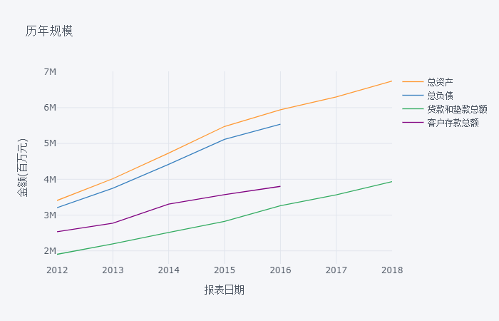

本文根据对招商银行定期披露报告数据分析，研究招商银行的投资价值。按照报告披露频度，本文每季度更新一次。


```python
# stks1 = ['工商银行','农业银行','中国银行','建设银行','交通银行']
# stks2 = ['招商银行','上海浦东发展银行','兴业银行','民生银行', '中信银行', '平安银行']
# stks3 = ['光大银行','华夏银行','广东发展银行','平安银行']
import pandas as pd
import numpy as np
# import plotly.graph_objs as go
import cufflinks as cf

import plotly.io as pio
pio.renderers.default = 'png'

# date range for filter columns
year = pd.date_range('20121231', '20181231', freq='A')
half_year = pd.date_range('20121231', '20190630', freq='2Q')

data_file = "http://dataframe.oss-cn-beijing.aliyuncs.com/banks.xlsx"
sheet_name = '招商银行'
data = pd.read_excel(data_file, sheet_name=None, index_col=0)
df = data['招商银行']
df.columns = pd.to_datetime(df.columns, format='%Y%m%d')

years = pd.date_range('20121231', '20181231', freq='A')
pd.set_option('display.precision', 2)

inds = ['总资产','总负债', '贷款和垫款总额', '客户存款总额']
# p1 = TimeSeries(df.loc[:, inds] / 100, y=inds, xlabel='', ylabel='', title='资产负债规模') # 将单位换算成亿元
# p2 = TimeSeries(df.loc[:, inds].pct_change() * 100, y=inds, xlabel='',ylabel='', title='资产负债规模增速')

fig = df.T.loc[years, inds].iplot(asFigure=True, xTitle='报表日期', yTitle='金额(百万元)', title='历年规模')
fig['layout']['xaxis']['tickvals'] = years
fig['layout']['xaxis']['ticktext'] = years.year
# fig.show(renderer='png')
fig
```





# 成长性指标

## 资产（贷款）、负债（存款）规模

## 营业收入


```python
# ts = pd.Series(df['营业收入(单季)'], )
inds2 = ['营业收入', '利息净收入', '手续费及佣金净收入', '营业支出']

# df.loc[year, inds2].pct_change() * 100
#(df.loc[year, inds2].pct_change() * 100).round(2).iplot(kind='scatter',xTitle='报表日期',yTitle='%(同比)',title='')
# df1 = df.loc[year,:]
# show(TimeSeries(df1['营业收入'] / df1['总资产'] * 100, xlabel='', ylabel='', title='营业收入/总资产', legend=''))
```

# 监管指标

## 资本充足率、拨备覆盖率、贷款拨备率


```python
# df.loc[:, ['一级资本充足率', '资本充足率']].iplot()
```

# 盈利性指标

## 净利差、净息差


```python
# df.loc[:, ['净利差', '净息差']].iplot(title=sheet_name)
```

## 非息收入占比、成本收入比


```python
# df['非息收入占比'] = df['手续费及佣金净收入'] / df['营业收入'] * 100
# df['成本收入比'] = df['业务及管理费'].abs() / df['营业收入'] * 100
# df.loc[:,['非息收入占比', '成本收入比']].round(2).iplot(xTitle='', yTitle='%(同比)')
```

# 资产质量

## 不良贷款率、核销比率、逾期率、拨备覆盖率


```python
# # p10 = TimeSeries(df, y=['不良贷款率', ''], xlabel='', ylabel='')
# # show(gridplot([p10], ncols=2))
# dff = df.loc[half_year, :]

# dff['不良贷款'] = dff['次级类贷款'] + dff['可疑类贷款'] + dff['损失类贷款']

# dff['逾期比率'] = dff['逾期贷款合计'] / dff['贷款和垫款总额']
# dff['90天以内逾期率'] = dff['逾期90天以内贷款'] / dff['贷款和垫款总额']
# dff['90天以上逾期率'] = (dff['逾期贷款合计'] - dff['逾期90天以内贷款']) / dff['贷款和垫款总额']

# dff['重组比率'] = dff['重组贷款'] / dff['贷款和垫款总额']
# dff['逾期+重组比率'] = (dff['逾期贷款合计'] + dff['重组贷款']) / dff['贷款和垫款总额']
# dff['核销率'] = dff['核销贷款'].abs() / dff['贷款和垫款总额']
# dff['核销前逾期重组比率'] = dff['逾期+重组比率'] + dff['核销率']
# dff['核销前逾期重组比率恶化程度'] = dff['逾期+重组比率'].diff() + dff['核销率']

# dff['不良率'] = dff['不良贷款'] / dff['贷款和垫款总额']
# dff['关注率'] = dff['关注类贷款'] / dff['贷款和垫款总额']
# dff['关注+不良率'] = (dff['关注类贷款'] + dff['不良贷款']) / dff['贷款和垫款总额']
# dff['核销前关注不良率'] = dff['关注+不良率'] + dff['核销率']
# dff['核销前关注不良恶化程度'] = dff['关注+不良率'].diff() + dff['核销率']

# cols1 = ['逾期比率', '重组比率', '逾期+重组比率', '核销率', '核销前逾期重组比率', '核销前逾期重组比率恶化程度']
# cols2 = ['不良率', '关注率', '关注+不良率', '核销率','核销前关注不良率', '核销前关注不良恶化程度']
# (dff.loc[half_year, cols1] * 100).round(2).iplot(title='资产质量-逾期重组口径')
# (dff.loc[half_year, cols2] * 100).round(2).iplot(title='资产质量-关注不良口径')

# # show(gridplot([p1,p2], ncols=1))
```


```python
# # dff[:, set.union(cols1, cols2)]
# # cs = set.union(cols1, cols2)
# # list(cs)
# dff.loc[half_year, set(cols1 + cols2)] * 100
# # dff[:, list(cs)]
```

## 五级分类迁徙率


```python
# df.loc[half_year, ['正常类贷款迁徙率','关注类贷款迁徙率','次级类贷款迁徙率','可疑类贷款迁徙率']].iplot(title='五级分类迁徙率')
```

# 特殊业务

## 资产托管

资产托管规模不断扩大，而且增速将近100%，与之相对应的是托管费收入增速在2015年以后有所下降，不过也在70%左右。主要原因是托管资产的取费率从6个基点现将到了5个基点。

尚需要判断与同业相比情况。


```python
# (df.loc[half_year, ['托管资产余额', '托管费收入']].pct_change() * 100).iplot(title='增长率')
# (df.loc[half_year, '托管费收入'] / df.loc[year, '托管资产余额']).iplot(title='托管资产取费率')
```

## 信用卡业务、投资银行、理财业务


```python
# inds = ['银行卡手续费', '结算与清算手续费', '代理服务手续费', '信贷承诺及贷款业务佣金', '托管及其他受托业务佣金', '其他']
# (df.loc[half_year, inds]).iplot(title='非利息收入（百万元）')
```


```python
# df.loc[year, inds].pct_change() * 100
```
